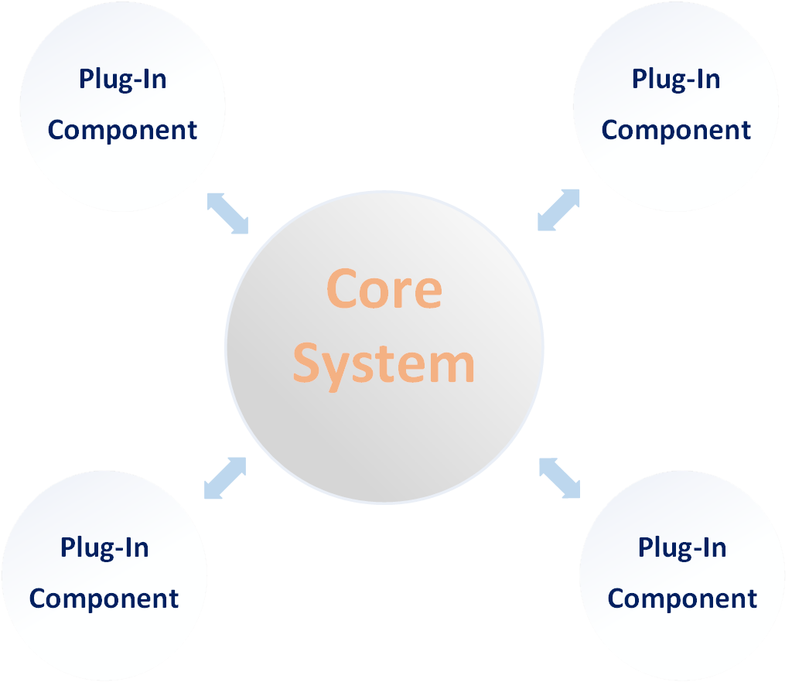
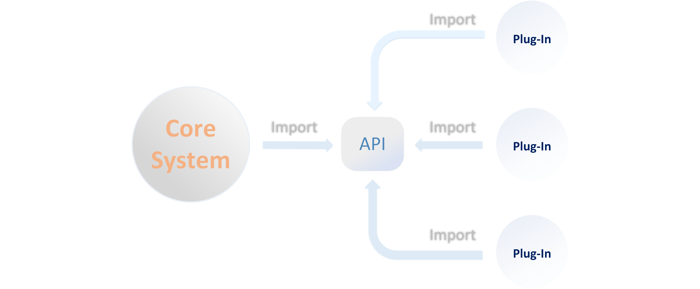
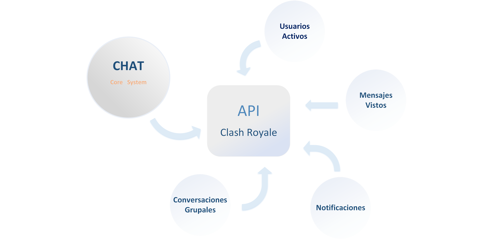

# Informe de Arquitecturas 

### Integrantes: 
 - Daniel de la Cruz Prieto
 - Camilo Rodriguez Velázquez
 - Julio Jose Horta Vazquez
 - Frank Adrian Perez Morales

### Arquitectura Microkernel 

La Arquitectura de Microkernel (Plug-in) permite crear aplicaciones extensibles, 
mediante la cual es posible agregar nueva funcionalidad mediante la adición de 
pequeños plugins que extienden la funcionalidad inicial del sistema.

En este tipo de arquitectura las aplicaciones tienes dos tipos de componentes: 
 -  EL sistema Core (o sistema central) 
 -  Plugins (o módulos)
 
El Sistema Core contiene los elementos mínimos para hacer que la aplicación 
funcione y cumpla el propósito para el cual fue diseñada.

Los  plugins o módulos son componentes periféricos que se añaden o instalan al 
componente Core para extender su funcionalidad. Es decir que solo puede haber 
un componente Core y muchos Plugins, como se muestra en el esquema siguiente: 

El objetivo de esta arquitectura es permitir la extensión de su funcionalidad 
o personalización, respetando el principio Open-Closed, es decir, está abierto 
para extender la funcionalidad, pero cerrado para modificar su funcionalidad 
principal. De esta forma, es posible que los desarrolladores puedan crear 
plugins para agregar nueva funcionalidad o extender la existente, pero sin 
alterar la funcionalidad Core del sistema.

***Ejemplos*** de esta arquitectura son los IDE’s de desarrollo como *Eclipse*, 
*Netbeans*, *Visual Studio*, *Visual Studio Code* o los sistemas de ofimática 
como *Word*, *Powerpoint*, *Excel*, etc. Todas estas aplicaciones permiten que 
los desarrolladores creen nueva funcionalidad, la cual se instala para extender 
o agregar nuevas características. 

En el caso de los IDE’s de desarrollo, tenemos plugins para permitir el uso 
de servidores de aplicaciones, soportar nuevos lenguajes de programación, 
para editar archivos de determinada extensión, para conectarnos a la base de 
datos, utilizar terminales, consumir servicios, etc. 

En el caso de los programas de ofimática tenemos la opción de conectarnos con 
servicios como Sharepoint, almacenamiento en la nube con Google Drive, DropBox, 
One Drive, integración con Slack, plugins para insertar firmas electrónicas, 
traducción, etc.

### Como se estructura una arquitectura *Microkernel*

Los sistemas que usan esta arquitectura no son fáciles de desarrollar, pues se 
necesita crear aplicaciones que sean capaces de agrandar dinámicamente su 
funcionalidad a medida que nuevos plugins sean instalados, al mismo tiempo debemos 
tener mucho cuidado de que los plugins no modifiquen o alteren la esencia de la 
aplicación.

El hecho de lograr que un sistema acepte plugins es complicado, porque por lo 
general el Sistema Core y los Plugins son desarrollados por equipos separados, 
por lo que el sistema Core debe de dejar muy en claro como los plugins deben ser 
desarrollados. Además debe tener un archivo descriptor que le diga al sistema 
Core como debe de instalarse o debería de mostrar el plugin ante el usuario.

El sistema Core debe de proporcionar un API o una definición la cual el plugin 
debe de implementar, de esta forma tenemos el sistema Core y el API que provee 
para que los desarrolladores creen los plugins. El API es una serie de clases 
o interfaces que deben ser implementadas por el Plug-in, las cuales serán 
analizadas por el sistema Core al momento de la instalación.

El API en realidad es un componente independiente del sistema Core(como se 
muestra en la imagen anterior), el cual contiene solamente las clases e 
interfaces que deberán conocer tanto el sistema Core como los Plugins.

Por lo general hay una interface o clase abstracta llamada Plugin la cual 
servirá como punto de entrada para el sistema Core, y le dará toda la 
información del Plugin al sistema Core.

### Utilización de esta arquitectura en el Clash Royale 

El problema en general no sería práctico desarrollarlo usando esta arquitectura 
pero si hay algunas funcionalidades del juego a las que se les puede dar solución 
usando esta, por ejemplo, podríamos añadirle funcionalidades como son un
chat al juego para que los jugadores puedan compartir información y artículos mediante 
la interfaz de la aplicación, también se podría añadir funcionalidades como son 
ver los distintos tipos de información que se dispone en la aplicación (tipos de cofre , 
batallas que están próximas a comenzar , etc ) que son de acceso para los 
Administradores de Base de Datos, pero que no son accesibles para 
el usuario común  y que con algún plugin podría estar disponible para este tipo 
de usuario. Existen cantidad de funcionalidades que pudieran ser extendidas 
mediante plugins, pero como es necesario para este tipo de arquitectura tendría que 
haber un enfoque destinado a este objetivo desde que se empiece a desarrollar la 
aplicación. Mas abajo se explica desde que capa de desarrollo se puede manejar algunos 
principios que tiene esta arquitectura. aplicar esta filosofía de poder añadir funcionalidades 
a la aplicación es posible como ya se dijo si se crea bien desde el inicio las bases en 
el Core System para que mas adelante terceros o los propios desarrolladores del la aplicación 
puedan trabajar en plugins que aumente la funcionalidad de la aplicación 

Si aplicamos esta arquitectura en la Capa correspondiente para añadir mas funcionalidades
al juego, podríamos representarlo de la siguiente manera: 

### Ventajas y desventajas de la arquitectura Microkernel

La arquitectura Microkernel (plug-in) nos aporta ciertas ventajas para implementar 
nuestros proyectos como: este tipo de arquitectura reacciona a los cambios 
realizados en los módulos de plug-in mientras minimiza los cambios en el sistema 
principal, por lo tanto requiere pocos cambios en el tiempo, lo cual nos aporta 
una estabilidad a largo plazo. A diferencia de las arquitecturas en capas, tener 
módulos de plug-in significa que es más fácil de implementar, minimizando así el 
tiempo de inactividad durante la implementación.

Debido a la naturaleza de Plugins es posible instalar fácilmente todas las 
características adicionales que sea necesarias, incluso, pueden ser agregar 
en tiempo de ejecución, lo que en muchos casos ni siquiera requiere de un 
reinicio del sistema. Algo muy positivo cuando se esta hablando del despliegue
de software. 

Las aplicaciones basadas en Plugins pueden habilitar o deshabilitar 
características basadas en perfiles, lo que ayuda que solo los plugins 
necesarios sean activados, incluso, pueden ser activados solo cuando son 
utilizados por primera vez (hot deploy), lo que hace que los módulos que nunca 
se utilizan, no se activen nunca, ahorrando una gran cantidad de recursos. Esto 
le da un dinamismo a la aplicación que potencia si uso.

Las pruebas en este tipo de arquitectura son muy fáciles de realizar debido a que 
los módulos de plug-in se pueden probar de manera aislada, lo que implica muy 
pocos o casi ningún cambio en el sistema central. Aunque generalmente no es la 
arquitectura ideal para usarse en aplicaciones de alto rendimiento, puede 
funcionar bien debido a la personalización de la aplicación para incluir solo 
las características que se necesitan.

Debido a que los Plugins puede ser instalados en cualquier instancia del 
sistema Core, es posible reutilizar los módulos en varias instancias, incluso, 
es posible comercializarlas de forma independiente. Solo como ejemplo, existe 
empresas que se dedican exclusivamente a desarrollar Plugins para venderlos, 
como es el caso de los Plugins de Wordpress. Esto es clave en la reutilización del 
software. 

Sin embargo, en las implementaciones con la arquitectura de microkernel las 
aplicaciones tienden a ser de un tamaño pequeño, por lo tanto, no son altamente 
escalables, esta característica depende de como se implementen los módulos de 
plug-in en ciertos niveles. Además, requiere un análisis exhaustivo del diseño 
antes de la implementación: los elementos a analizar incluyen el control de 
versiones de contratos, los registros internos de los plug-in y las amplias 
opciones disponibles para la conectividad plug-in.

### Implementación 

El producto que utilizaremos para nuestra implementación es el presentado en el 
seminario de especificación de requerimientos: “Clash Royale”.

Utilizaremos varios tipos de arquitectura para este programa una de estas es la 
arquitectura Cliente-Servidor N-Capas (tres capas) donde existen tres tipos de 
capas: 

- *Capa de Presentación*: Esta capa está destinada al usuario, por lo cual también se 
le denomina "Capa de Usuario". En esta, el usuario intercambiará con una interfaz 
gráfica, donde se le presentará el sistema de una manera fácil y entendible de 
usar. Es donde el usuario podrá analizar que acciones quiere realizar en nuestra 
aplicación, como la creación y edición de un perfil, selección del modo de 
batalla, etc... 

- *Capa de Negocio*: En esta se reciben las peticiones del usuario, a través de la 
comunicación con la Capa de Usuario, se evalúa esta información y se procesa 
para solicitar al gestor de base de datos lo que se necesita. Luego se comunica 
nuevamente con la Capa de Presentación para presentar los resultados adquiridos. 
En esta capa se consideran los programas de la aplicación. 

- *Capa de datos*: Es la capa encargada del almacenamiento de los datos y también del 
acceso a los mismos. En esta se almacenan, recuperan o se reciben a través de la 
Capa de Negocio los datos utilizados. Esta capa es de vital importancia en nuestro 
proyecto debido a la gran cantidad de información que se desea de recopilar en 
nuestra aplicación como: información de las cartas, usuarios, cofres, batallas, 
entre otras más. 

En la Capa de Negocio utilizaremos la arquitectura de Microkernel (plug-in) en 
donde implementaremos cada una de las funcionalidades que puede tener nuestro 
programa como: creación y edición del perfil, almacenamiento de cofres, chat del 
programa, obtención de artículos, etc… cada una de estas serán implementadas por 
separado siendo los plug-in todos los métodos que cada una de estas pueden 
realizar. Por ejemplo en el requisito de Perfil del jugador cada uno de los 
plug-in serán la información que se desea saber del jugador en cuestión: como su 
apodo, nivel , cantidad de victorias , etc.(todas estas informaciones van a estar 
almacenadas en la base de datos (Capa de datos)) y el sistema principal se 
encargará de funcionalidades principales como la actualización en la base de 
datos de todas estas informaciones. 

Este tipo de arquitectura nos permite a la hora de crear cada uno de los 
plug-in una fácil implementación e incluso cuando se les realicen pruebas a 
estos poder modificarlos sin afectar el sistema principal. Además, se toma en 
cuenta este tipo de arquitectura debido a que si se le desea añadir alguna otra 
funcionalidad más simplemente se le puede añadir otro plug-in a la funcionalidad 
que se quiera actualizar. 

#### Patrones de presentación.
 
1. Utilizaremos el patrón de presentación Modelo-Vista-Controlador(MVC) para todo lo 
relacionado con el combate ya que nos permite tener un fácil manejo de las 
actualizaciones de la pantalla a través de Observer ya que al cambiar un 
elemento este notificará a todas sus dependientes de este cambio, además de que 
nos permite recibir las instrucciones de forma encapsulada y parametrizada a 
través de Command lo que nos ayuda a entender y trabajar cada orden dígase de 
ataque, uso de cartas, de una forma bien consensada. 

2. Para los menus, submenús y pantallas de carga utilizaremos el patrón Forms 
and Controls ya que solo bastaría blindear unas pocas instrucciones a un evento 
para ser trabajadas sin mucho cambio a futuro. 

#### Patrones de acceso a datos.

Utilizaremos el patrón Unit of Work ya que tendremos muchos objetos en 
concurrencia trabajando y este patrón nos brinda un buen control sobre todo en 
la parte del combate donde habrá diferentes instancias de una clase en el tablero.

### Conclusiones 

Como se hemos podido analizar el estilo arquitectónico de Microkernel permite 
extender la funcionalidad de sistema mediante la adición de Plugins, 
dichos plugins pueden ser desarrollados por terceros, lo que amplía las 
posibilidades de la aplicación Core sin necesidad de costear los desarrollos, 
al mismo tiempo que permites que puedan personalizar al máximo el sistema.

Por otra parte, podemos observar que un sistema basado en Microkernel permite 
tener múltiples equipos de desarrollo que construyen los módulos en paralelo 
sin interferir unos con otros, al mismo tiempo que permite que estos componentes 
sean probados de forma independiente, por lo que podemos decir que este estilo 
es fácil de probar.

Sin embargo, hemos visto que uno de las principales problemáticas de este estilo 
arquitectónico es su alta complejidad de desarrollar y su escalabilidad, lo cual 
puede ser una limitante para sistemas que deben ser diseñados para un alto 
escalamiento.