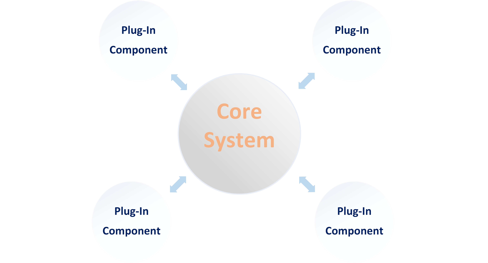

# Informe de Arquitecturas 

### Integrantes: 
 - Daniel de la Cruz Prieto
 - Camilo Rodriguez Velazquez
 - Julio Jose Horta Vazquez
 - Frank Adrian Perez Morales

### Arquitectura Microkernel 

La Arquitectura de Microkernel (Plug-in) permite crear aplicaciones extensibles, 
mediante la cual es posible agregar nueva funcionalidad mediante la adición de 
pequeños plugins que extienden la funcionalidad inicial del sistema.

En este tipo de arquitectura las aplicaciones tienes dos tipos de componentes: 
 -  EL sistema Core (o sistema central) 
 -  Plugins (o módulos)
 
El Sistema Core contiene los elementos mínimos para hacer que la aplicación 
funcione y cumpla el propósito para el cual fue diseñada.

Los  plugins o módulos son componentes periféricos que se añaden o instalan al 
componente Core para extender su funcionalidad. Es decir que solo puede haber 
un componente Core y muchos Plugins, como se muestra en el esquema siguiente: 

El objetivo de esta arquitectura es permitir la extensión de su funcionalidad 
o personalización, respetando el principio Open-Closed, es decir, está abierto 
para extender la funcionalidad, pero cerrado para modificar su funcionalidad 
principal. De esta forma, es posible que los desarrolladores pueden crear 
plugins para agregar nueva funcionalidad o extender la existente, pero sin 
alterar la funcionalidad Core del sistema.

***Ejemplos*** de esta arquitectura son los IDE’s de desarrollo como *Eclipse*, 
*Netbeans*, *Visual Studio*, *Visual Studio Code* o los sistemas de ofimática 
como *Word*, *Powerpoint*, *Excel*, etc. Todas estas aplicaciones permiten que 
los desarrolladores creen nueva funcionalidad, la cual se instala para extender 
o agregar nuevas características. 

En el caso de los IDE’s de desarrollo, tenemos plugins para permitir el uso 
de servidores de aplicaciones, soportar nuevos lenguajes de programación, 
para editar archivos de determinada extensión, para conectarnos a la base de 
datos, utilizar terminales, consumir servicios, etc. 

En el caso de los programas de ofimática tenemos la opción de conectarnos con 
servicios como Sharepoint, almacenamiento en la nube con Google Drive, DropBox, 
One Drive, integración con Slack, plugins para insertar firmas electrónicas, 
traducción, etc.

### Como se estructura una arquitectura *Microkernel*

Los sistemas que usan esta arquitectura no son fáciles de desarrollar, pues se 
necesita crear aplicaciones que sean capaces de agrandar dinámicamente su 
funcionalidad a medida que nuevos plugins sean instalados, al mismo tiempo debemos 
tener mucho cuidado de que los plugins no modifiquen o alteren la esencia de la 
aplicación.

El hecho de lograr que un sistema acepte plugins es complicado, porque por lo 
general el Sistema Core y los Plugins son desarrollados por equipos separados, 
por lo que el sistema Core debe de dejar muy en claro como los plugins deben ser 
desarrollados. Además debe tener un archivo descriptor que le diga al sistema 
Core como debe de instalarse o debería de mostrar el plugin ante el usuario.

El sistema Core debe de proporcionar un API o una definición la cual el plugin 
debe de implementar, de esta forma tenemos el sistema Core y el API que provee 
para que los desarrolladores creen los plugins. El API es una serie de clases 
o interfaces que deben ser implementadas por el Plug-in, las cuales serán 
analizadas por el sistema Core al momento de la instalación.

El API en realidad es un componente independiente del sistema Core(como se 
muestra en la imagen anterior), el cual contiene solamente las clases e 
interfaces que deberán conocer tanto el sistema Core como los Plugins.

Por lo general hay una interface o clase abstracta llamada Plugin la cual 
servirá como punto de entrada para el sistema Core, y le dará toda la 
información del Plugin al sistema Core.

