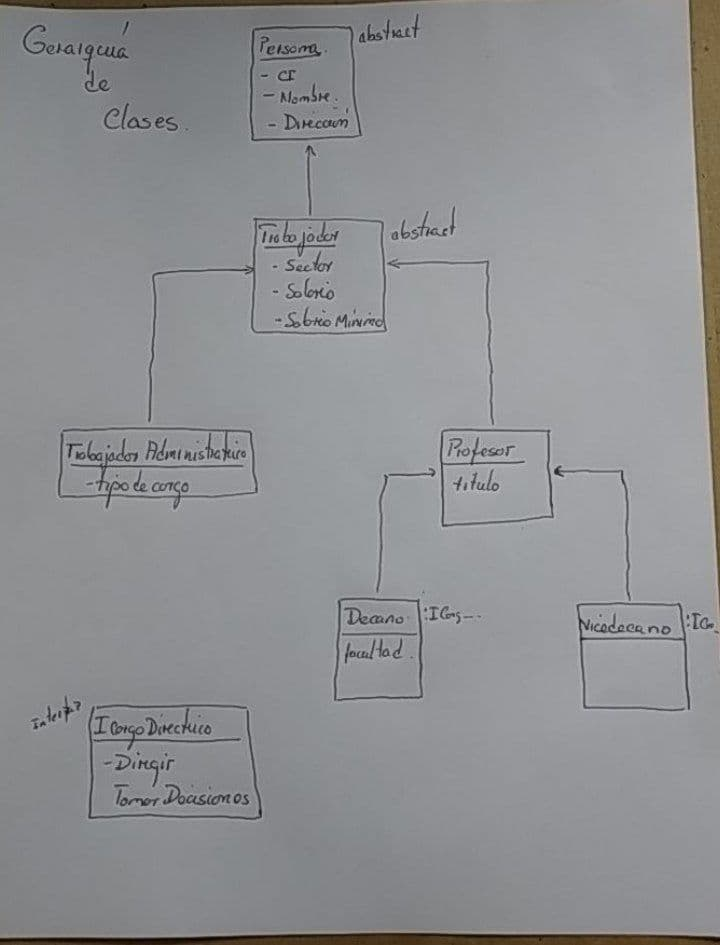

# Informe de Buenas Prácticas y principios 

 ##### Integrantes del Equipo:
  - Daniel de la Cruz Prieto 
  - Camilo Rodriguez Velazquez
  - Julio Jose Horta Vazquez 
  - Frank Adrian Perez Morales

El Principio de Sustitución de Liskov o LSP (Liskov Substitution Principle) corresponde a la sigla L dentro de los cinco principios SOLID para mantener una buena práctica de programación.

Este fue presentado en una conferencia titulada Abstracción de Datos y Jerarquía en el año 1988 por Bárbara Liskov, una reconocida ingeniera de software americana que fue la primera mujer en Estados Unidos en conseguir un Doctorado en Ciencias de la Computación. Liskov lo definió como algo parecido a la siguiente propiedad de sustitución:

- “Si S es un subtipo de T entonces los objetos de tipo T pueden ser pueden ser reemplazados con objetos de tipo S, sin alterar ninguna de las propiedades deseadas del programa (correctitud, ejecución de sus métodos, etc.)

Posteriormente fue formulado por Barbara Liskov y Jeannette Wing de manera conjunta en un artículo en el año 1994.

LSP es una serie de pautas para guiar jerarquías de herencia en las cuales, el desarrollador podrá utilizar de manera confiable cualquier clase o “clase hija” (clases que heredan de otra clase) sin comprometer su comportamiento. Es decir, se debe cumplir (si se realiza la herencia de una manera correcta) que el comportamiento de una clase hija, debe permanecer compatible con el de su “clase padre” (clase de la cual hereda). Este principio se evidencia mejor en ejemplos de como violarlo: si cuando se sobrescribe un método en la “clase hija” se necesita poner una excepción o simplemente el método no realiza nada, probablemente se esté violando el LSP.

Algunas de las pautas que conforman LSP son: 
-  Las condiciones previas (métodos, atributos) de una clase padre no pueden “fortalecerse” en una clase hija,
-  las invariantes (condiciones que deben permanecer verdaderas) de la clase padre deben conservarse en cualquier clase que herede de esta, entre otras más.

En nuestra opinión este Principio es de gran importancia para facilitar la reusabilidad del código de cualquier tipo de programa, sus conceptos fundamentales son vitales en el desarrollo de frameworks y librerías, debido a que al cumplir el LSP en estos, sus clases podrán ser utilizadas por terceros evitando las ambigüedades y los fallos que pueda tener la jerarquía de las clases de estos.

## Código 

Este es el esquema del código que realizamos para mostrar como sería una debida implementación de el ejemplo. 

Hicimos una solución de **Visual Studio 2019**  , abajo esta el diagrama(jerarquía de clases ) de como esta implementada la solución nuestra.

