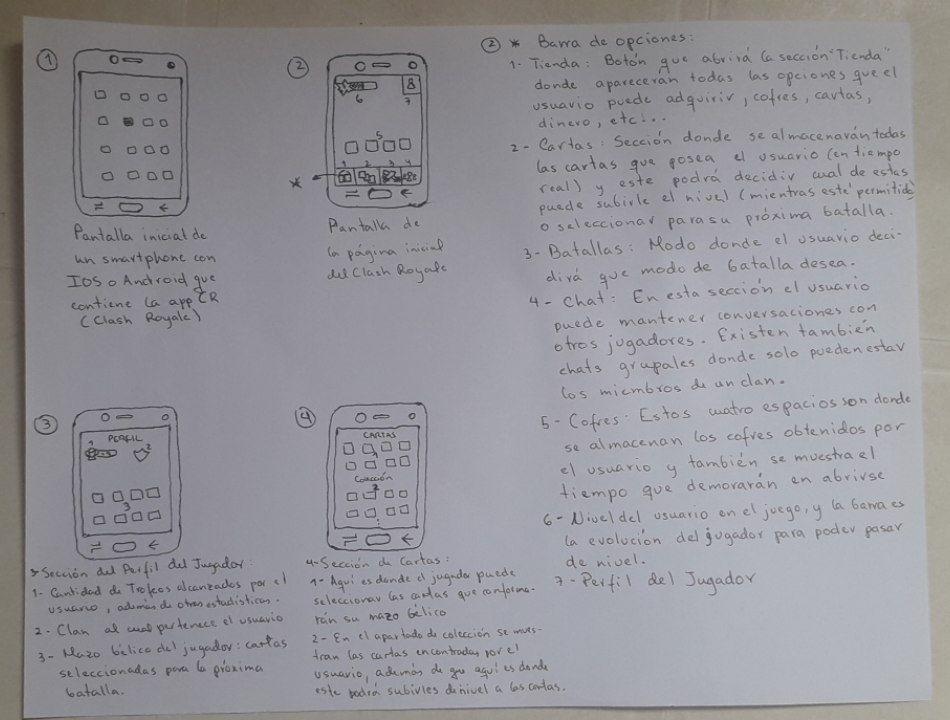
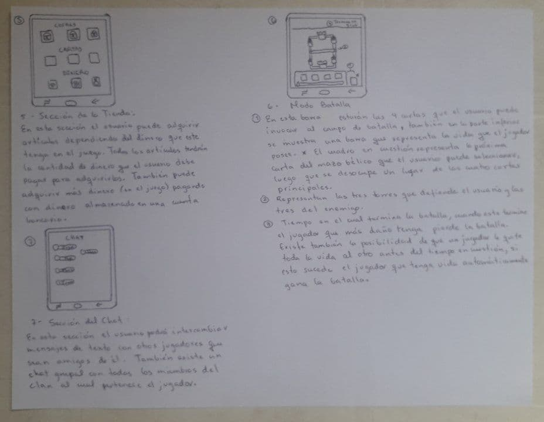

## Lenguajes de Especificación
- ***Storyboard** tipo 2* 
- ***UML** con diagrama de actividades* 

### Historia y algunos aspectos básicos de Storyboard 

El storyboard es una colección de ilustraciones secuenciales que se utilizan como
una guía para entender una historia, dar publicidad a un prducto, previsualizar
una animación o seguir la estructura de una película antes de realizarla o firmarla.

La creación de  storyboard se atribuye a Georges Méliés (ilusionista y cineasta 
francés). El proceso del 
storyboarding, en la forma que se conoce hoy fue desarrollado por Webb Smith 
en el estudio de Walt Disney durante principios de los años 1930,
El storyboarding se hizo popular en la producción de películas de acción 
viva durante principios de los años 1940. 

La elaboración de un storyboard está en función de su uso: en publicidad 
o videos comerciales o institucionales es mucho más técnico y elaborado 
para que sirva de guía a cada miembro del equipo de trabajo.

### Historia y algunos aspectos básicos de UML

Después de que la Rational Software Corporation contratara a James Rumbaugh 
de General Electric, en 1994, la compañía se convirtiría en la fuente de los 
dos esquemas de modelado orientado a objetos más populares de la época.

Poco después se les uniría Ivar Jacobson, el creador del método de ingeniería
de software orientado a objetos. Jacobson se uniría a Rational, en 1995, 
después de que su compañía Objectory AB fuera comprada por Rational.

En 1996 Rational concluyó que la abundancia de lenguajes de modelado estaba 
alentando la adopción de la tecnología de objetos, y para orientarse hacia un
método unificado, encargaron a los Tres Amigos que desarrollaran un 
"lenguaje unificado de modelado" abierto. Se consultó con representantes de 
compañías competidoras en el área de la tecnología de objetos durante la 
OOPSLA '96; eligieron "cajas" para representar clases en lugar de la notación
de Booch que utilizaba símbolos de "nubes". 

Bajo la dirección técnica de los Tres Amigos (Rumbaugh, Jacobson y Booch) fue 
organizado un consorcio internacional llamado UML Partners en 1996 para 
completar las especificaciones del UML.

El borrador de la especificación UML 1.0 de UML Partners fue propuesto a la 
OMG en enero de 1997. Durante el mismo mes, la UML Partners formó una Fuerza 
de Tarea Semántica, encabezada por Cris Kobryn y administrada por Ed Eykholt, 
para finalizar las semánticas de la especificación y para integrarla con otros 
esfuerzos de estandarización. El resultado de este trabajo, el UML 1.1, fue 
presentado ante la OMG en agosto de 1997 y adoptado por la OMG en 
noviembre de 1997. 

### Ventajas y desventajas de los lenguajes

Los lenguajes que utilizamos para nuestra especificación de requerimientos son: Storyboard tipo 2 y UML con Diagrama de Actividades.  

En el Storyboard tipo 2 se combinan los mockups del programa en cuestión con el flujo básico de los casos usos, para mostrar al usuario como interactuará con la interfaz del programa en su fase final. Este tipo de diseño ayuda al usuario a identificar cuales aspectos del programa son de su agrado y cuales no, debido a la visibilidad que tiene del producto, aunque este no esté todavía implementado, es decir el usuario gracias a este tipo de lenguaje tendrá una “maqueta” de la interfaz del programa final. 
En él fuimos mostrando todas las etapas por las cuales el usuario debe pasar desde la selección de la aplicación en un dispositivo móvil, hasta cada una de las opciones que la persona puede seleccionar dentro de la aplicación, explicando detalladamente la función de cada uno de los elementos que conforman la interfaz de esta. Este tipo de Storyboard ayuda a los desarrolladores a identificar los problemas visuales que puede tener el software y es muy importante a la hora de poder crear un manual para el usuario. 

Una de las desventajas que tiene es que como es una “maqueta visual” los desarrolladores no podrán identificar problemas más detallados como las acciones que el usuario puede realizar o no al estar en contacto con el producto, o problemas a nivel de implementación del software. Además, que como queremos enseñarle al cliente todas las etapas de la aplicación tuvimos que crear las maquetas de cada una de estas, y como este software en particular tiene varios requerimientos fueron muchas maquetas, además, de la explicación de cada uno de los elementos que contiene la interfaz. 

El lenguaje UML con Diagrama de Actividades es una alternativa del lenguaje natural para la descripción de escenarios, en él se representa los flujos de los casos usos, paso a paso. Estos se utilizan para representar el comportamiento dinámico de un sistema, principalmente en la secuencia de actividades que se llevan a cabo y las condiciones que guardan o ejecutan esas actividades. 

Este lenguaje ayuda a la comprensión del proceso del programa, debido que al mostrarlo con un dibujo es fácil de entender, también gracias a la simplicidad de la visualización nos ayuda a identificar los problemas y los puntos en los cuales se puede mejorar el proceso. En un plano profesional este tipo de lenguaje ayuda en la capacitación de los nuevos desarrolladores que se unan al equipo de creación del programa. La desventaja fundamental de este lenguaje es en la creación del diagrama, la cual se puede complejizar si el programa es demasiado extenso, es decir contiene varios requerimientos.

### UML con Diagrama de Actividades 

Para comenzar el juego lo primero que debemos hacer es descagarnos la aplicación y una vez descargada, comenzar su instalación.
Luego al entrar a la interfaz de la aplicación por primera vez, nos aparece una pantalla donde nos dice si queremos jugar el tutorial del juego.  

Luego de entrar en el modo de juego tenemos un menú con varios paneles para interactuar.

- Tienda
- Cartas
- Batalla
- Social
- Eventos

El apartado de la Tienda, Una vez dentro de este apartado tienes la opción de regrasar a la pantalla principal de la aplicación

El apartado de Administración de las cartas del usuario, Puedes regresar a la pantalla principal de la aplicación. 

En esta sección puedes entrar a las redes sociales donde tiene las principales páginas la aplicación. Una vez ahí existe la opción de regresar a la aplicación

Aquí puedes ver los distintos eventos que tiene el juego ,desde aquí también puedes regresar a la aplicación 

## StoryBoard

 

#### 1-Pantalla inicial de un smartphone con IOs o android que contiene la app Clash Royale 

#### 2- Pantalla de la pagina principal inicial de Clash Royale
##### Barra de Opciones: 
1. **Tienda** : Botón que habrirá la opción "Tienda" donde aparecerán todas las operaciones que el usuario puede adquirir, cofres, cartas, dinero, etc ...
2. **Cartas**: Sección donde se almacenarán todas las cartas que posea el usuario (en tiempo real) y este podrá dicidir cuál de estas puede subirle el nivel (mientras este permitido) o seleccionar para su próxima batalla.
3. **Batallas**: Modo donde el usuario decidirá que modo de batalla desea. 
4. **Chat**: En esta sección el usuario puede mantener conversaciones con otros jugadores. Existen también chats grupales donde solo pueden estar los miembros de un clan. 
5. **Cofres**: Estos cuatro espacios es donde se almacenan los cofres obtenidos por el usuario y también se muestra el tiempo que demoran en abrirse
6. **Nivel del usuario en el juego**, y la barra es la evolución del jugador para poder pasar de nivel.  
7. **Perfil del jugador** 

#### 3 Sección del perfil del Jugador.
1. Cantidad de trofeos almacenados por el usuario , además de otras estadisticas.
2. Clan al cual pertenece el usuario. 
3. Mazo bélico del jugador: cartas seleccionadas para la próxima batalla . 

#### 4 Sección de cartas: 
1. Aquí es donde el jugador puede selecionar las cartas que conformaran su mazo bélico 
2. En el apartado de colección se muestran las cartas encontradas por el usuario , además de que aquí es donde este podrá subirles el nivel a las cartas. 

#### 5- Sección de la Tienda:

En esta sección el usuario puede adquirir artículos dependiendo del dinero que este tenga en el juego. Todos los artículos tendrían la cantidad de dinero que el usuario debe pagar para adquirilos. También
puede adquirir mas dinero (en el juego) pagando con dinero almacenado en una cuenta bancaria.

#### 6- Modo Batalla 
1. En esta barra estarán las cuatro cartas que el usuario puede invocar al campo de batalla, también en la parte inferior se muestra una barra que representa la vida que el jugador posee. El cuadro en cuestión representa la próxima carta del mazo bélico que el usuario puede seleccionar, luego que se desocupe un lugar de las cuatro cartas principales. 
2. Representan las tres torres que defiende el usuario y las tres del enemigo. 
3. Tiempo en el cuál termina la batalla, cuando esta termine el jugador que más daño tenga pierde la batalla. Existe también la posibilidad de que un jugador le quite toda la vida al otro antes del tiempo en cuestión, si esto sucede el jugador que tenga vida automaticamente gana la batalla.  

#### 7- Sección del chat
En esta sección el usuario podrá intercambiar mensajes de texto con otros jugadores que sean amigos de él. También existe en chat grupal con todos los miembros del clan al cual pertenece el jugador. 
