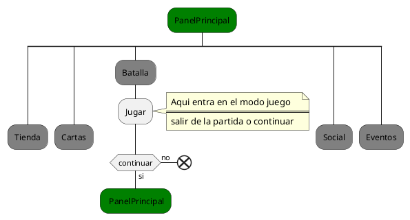

## Lenguajes de Especificación
- ***Storyboard** tipo 2* 
- ***UML** con diagrama de actividades* 

### Historia y algunos aspectos b�sicos de Storyboard 

una guía para entender una historia, dar publicidad a un prducto, previsualizar
El storyboard es una colección de ilustraciones secuenciales que se utilizan como

una animación o seguir la estructura de una película antes de realizarla o firmarla.
francés). El proceso del 
La creación de  storyboard se atribuye a Georges M�li�s (ilusionista y cineasta 
storyboarding, en la forma que se como hoy fue desarrollado por Webb Smith 
en el estudio de Walt Disney durante principios de los a�os 1930,
El storyboarding se hizo popular en la producci�n de pel�culas de acción 
viva durante principios de los aos 1940. 

La elaboraci�n de un storyboard est� en funci�n de su uso: en publicidad 
o videos comerciales o institucionales es mucho m�s t�cnico y elaborado 
para que sirva de gu�a a cada miembro del equipo de trabajo.

### Historia y algunos aspectos b�sicos de UML

Despu�s de que la Rational Software Corporation contratara a James Rumbaugh 
dos esquemas de modelado orientado a objetos m�s populares de la �poca.
de General Electric, en 1994, la compa�a se convirti� en la fuente de los 

Poco despu�s se les uni� Ivar Jacobson, el creador del m�todo de ingenier�a 
de software orientado a objetos. Jacobson se uni� a Rational, en 1995, 

despu�s de que su compa�a Objectory AB fuera comprada por Rational.
m�todo unificado, encargaron a los Tres Amigos que desarrollaran un 
En 1996 Rational concluyó que la abundancia de lenguajes de modelado estaba 
alentando la adopción de la tecnolog�a de objetos, y para orientarse hacia un
compa��as competidoras en el área de la tecnología de objetos durante la 
"lenguaje unificado de modelado" abierto. Se consultó con representantes de 
OOPSLA '96; eligieron "cajas" para representar clases en lugar de la notaci�n
de Booch que utilizaba s�mbolos de "nubes". 

Bajo la direcci�n t�cnica de los Tres Amigos (Rumbaugh, Jacobson y Booch) fue 
organizado un consorcio internacional llamado UML Partners en 1996 para 
completar las especificaciones del UML.

El borrador de la especificaci�n UML 1.0 de UML Partners fue propuesto a la 
OMG en enero de 1997. Durante el mismo mes, la UML Partners form� una Fuerza 
de Tarea Sem�ntica, encabezada por Cris Kobryn y administrada por Ed Eykholt, 
para finalizar las sem�nticas de la especificaci�n y para integrarla con otros 
esfuerzos de estandarizaci�n. El resultado de este trabajo, el UML 1.1, fue 
presentado ante la OMG en agosto de 1997 y adoptado por la OMG en 
noviembre de 1997. 

### Ventajas y desventajas de los lenguajes

Los lenguajes que utilizamos para nuestra especificaci�n de requerimientos son:
Storyboard tipo 2 y UML con Diagrama de Actividades. 
 
En el Storyboard tipo 2 se combinan los mockups del programa en cuesti�n con 
el flujo b�sico de los casos usos, para mostrar al usuario como interactuar� 
con la interfaz del programa en su fase final. Este tipo de dise�o ayuda al 
usuario a identificar cuales aspectos del programa son de su agrado y cuales 
no, debido a la visibilidad que tiene del producto, aunque este no est� 
todav�a implementado, es decir el usuario gracias a este tipo de lenguaje 
tendr� una �maqueta� de la interfaz del programa final.
 
En �l fuimos mostrando todas las etapas por las cuales el usuario debe pasar 
desde la selecci�n de la aplicaci�n en un dispositivo m�vil, hasta cada una 
de las opciones que la persona puede seleccionar dentro de la aplicaci�n, 
explicando detalladamente la funci�n de cada uno de los elementos que 
conforman la interfaz de esta.

Este tipo de Storyboard ayuda a los desarrolladores a identificar los 
problemas visuales que puede tener el software y es muy importante a la hora 
de poder crear un manual para el usuario. 

Una de las desventajas que tiene es que como es una maqueta visual los 
desarrolladores no podrín identificar problemas más detallados como las 
acciones que el usuario puede realizar o no al estar en contacto con el 
producto, o problemas a nivel de implementación del software. Además, que 
como queremos enseñarle al cliente todas las etapas de la aplicación 
tuvimos que crear las maquetas de cada una de estas, y como este software 
en particular tiene varios requerimientos fueron muchas maquetas, además, 
de la explicación de cada uno de los elementos que contiene la interfaz. 
El lenguaje UML con Diagrama de Actividades es una alternativa del lenguaje 
natural para la descripción de escenarios, en él se representa los flujos de 
los casos usos paso a paso. Estos se utilizan para representar el 
comportamiento dinámico de un sistema, principalmente en la secuencia de 
actividades que se llevan a cabo y las condiciones que guardan o ejecutan 
esas actividades. 

Este lenguaje ayuda a la comprensión del proceso del programa, debido que al 
mostrarlo con un dibujo es fácil de entender, también gracias a la simplicidad 
de la visualización nos ayuda a identificar los problemas y los puntos en los 
cuales se puede mejorar el proceso. En un plano profesional este tipo de 
lenguaje ayuda en la capacitación de los nuevos desarrolladores que se unan 
al equipo de creación del programa. La desventaja fundamental de este lenguaje 
es en la creación del diagrama, la cual se puede complejizar si el programa 
es demasiado extenso, es decir contiene varios requerimientos.


#### UML con Diagrama de Actividades 

Para comenzar el juego lo primero que debes hacer es desargaros la aplicacion y una vez descargada , comenzar su instalacion 

Luego al entrar a la interfaz de la aplicacion por primera vez, nos aparece una pantalla donde nos dice si queremos jugar el tutorial del juego  


<!-- ```plantuml 
@startuml name
start
:Instalar el Juego;
if (Jugar el Tutorial) then
    :Tutorial;
endif
#Green: PanelPrincipal; 
@enduml
``` -->



