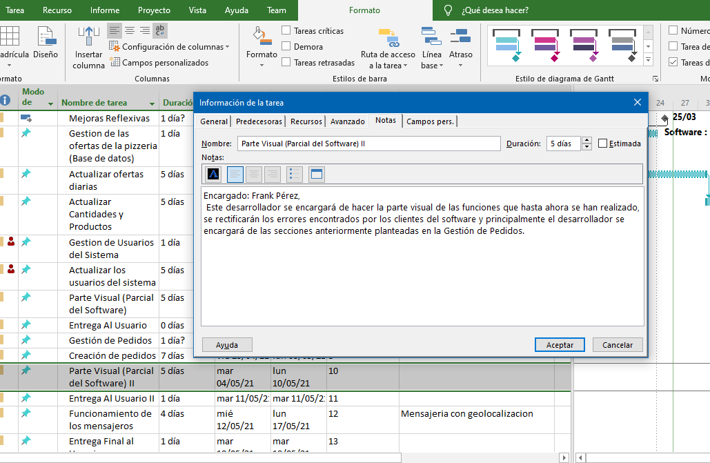

# Informe Planificación de Gestión de Riesgos

## 1 Metodología a aplicar para el desarrollo del Proyecto 
 
Para el desarrollo de este software consideramos usar Crystal Clear como metodología 

La razón por la que escogimos Crystal Clear es por la facilidad que nos brinda para administrar este 
tipo de entorno y de problema dado que es una metodología ágil. Además que somos un equipo 
de 4 integrante, y esta metodología está orientada a equipos de 3 a 8 integrantes, es decir 
equipos pequeños.

Esta metodología tiene una característica que favorece mucho y son las entregas frecuentes, 
que se basa en las entregas del software a los usuarios para permitir que los cliente 
pueda interactuar con este para identificar los problemas que puedan surgir. 
Además que puede servir como una referencia para posibles problemas que ocurran. 

Como somos un equipo pequeño la  *Seguridad Personal* donde cada miembro del equipo tiene permitido hablar cuando 
hay algo que consideren que esté mal acerca del proyecto, sin tener miedos ni 
represalias(todo esto lo favorece el hecho de que el equipo es solo de 4 personas y somos muy buenos compañeros de equipo).

Ademas que se puede definir las partes sobre las cuales cada desarrollador debe 
concentrar su trabajo, e interactuar con las demás partes de desarrollo que tiene el software.

#### Planificación 

La planificación tendría lugar al principio del desarrollo del software, aunque después 
tendría una revision y modificación en el calendario del desarrollo y revisiones 
provocadas por imprevistos que puedan surgir a lo largo de la producción del software.

#### Ventajas y desventajas para la gestión de riesgos 

Como ventajas tendríamos la prevención de futuras inconformidades del cliente. 
Pero sobretodo la planificación bien detallada de un resultado podría traer 
buena aceptación por parte del cliente y sobre todo favorecer al desarrollo al tomarse en cuenta 
aspectos que mejoraría el rendimiento ya sea para futuras versiones del software o para aspectos específicos del desarrollo 
que puedan traer resultado positivos a largo plazo. 

Podría decirse que la productividad del equipo se vería beneficiada y el tiempo de desarrollo se podría acortar si 
se toman decisiones bien fundamentada en el desarrollo. 

Podríamos decir que tomar una decision que no haya sido consultada y depurada lo suficiente podría traer impacto para el producto 

Como desventajas el producto final pudiera ver afectada su replicabilidad y futuras correcciones en el software. 
Entonces futuros cambios debido a corrección de errores o simplemente requerimientos del usuario pudieran ser imposibles o requerir un cambio completo en el diseño del software 

Pues si en algún punto se decide tomar una decision que no este bien materializada(por falta de tiempo en la gestión o por simplemente considerarse beneficiosa por parte de los desarrolladores).
## 2 Planificación para la ejecución del Proyecto 

El diagrama describe la planificación para la ejecución del proyecto mediante un diagrama de Gantt

El diagrama esta hecho en Project Pro . En la carpeta *DiagramadeGantt* hay un fichero con nombre *DiagramadeGant.mpp* , en este fichero esta el source  del Diagrama hecho en  Project Pro 

Descripción y asignación de las actividades 

Mejoras reflexivas 

Gestión de las ofertas de pizzeria (Base de Datos)

Actualizar ofertas diarias

Actualizar cantidad y producto 

Gestión de usuarios del sistema

Actualizar los usuarios del sistema 

Parte Visual (Parcial del software) 

Entrega al usuario 

Gestión de Pedidos 

Creación de Pedidos 

Parte Visual (Parcial del software) II 

Entrega al Usuario II 

Funcionamiento de los Mensajeros 

Entrega Final al usuario

## 3 Riesgos que están asociados 

##### 1- Suplantación de identidad por parte de un tercero que empiece a realizar pedidos falsos.
Esto se clasifica como una amenaza ya que un usuario troll puede afectar las ganancias de la pizzería al empezar a hacer estos pedidos. Este problema no es posible de resolver en su totalidad, ya que es imposible asegurar que alguien se robe las contraseñas de otra persona, pero podemos mitigarlo siguiendo 2 estrategias: 
1. Implementando más sistemas de seguridad como la encriptación de los paquetes de datos de los usuarios que solo tenga la llave el usuario una vez se cree su cuenta, entre otras técnicas de seguridad.
2. Cuando un usuario se cree una cuenta, se hará hincapié en que es importante que no le dé su contraseña a nadie, se podría gestionar un sistema de recompensa a los usuarios después de cierto tiempo y en caso de perder estos la cuenta o que le roben las contraseñas perderían beneficios.

##### 2- Ataque de negación de servicios. 
Esto provocaría que la el sitio se volviera extremadamente lento o incluso temporalmente inaccesible al estar recibiendo pedidos los cuales tienen solo el objetivo de ocupar la capacidad total de procesamiento de nuestros servidores e imposibilitar el acceso a este por parte de otros usuarios. La opción que tomaría nuestro equipo seria transferir la solución del problema a un tercero que este especializado en seguridad.

1. Este realizara un Sistema de reconocimiento de mensajes de usuarios reales ignorando a los lanzados por maquinas en forma de spam, con algún método de Snapchat o algo similar 

##### 3- Problemas con los pedidos (que no se correspondan los que hay en la base de datos y los que realmente hay en oferta  .

Esto pudiera suceder por mala gestión de los usuarios a la hora de interactuar con la plataforma. por desconocimiento 
del funcionamiento de la aplicación. Los programadores quedan ajeno a eso , pues sucede que ellos solo se encargan de que la plataforma funcione. Los 
administradores serian los responsables del buen manejo y aplicación de esta

 1 . Esto podría ser resuelto asignando a un encargado y responsable de la administración de la aplicación como administrador. 

##### 4- Problemas a la hora de el pago de los cliente 

Pudiera suceder que los clientes tuvieran algún contratiempo a la hora del pago de las entregas que se le hacen , esto haría que si un usuario no hace el pago en el plazo establecido o por los medios que 
se estableció ocurran algunos desajusten en el correcto funcionamiento de la plataforma en general. 

1. Esto pudiera solucionarse obligando a los usuarios a hacer los pagos de la forma establecida (usando solo tarjetas) y no de otra forma. 
2. Pero esto podría suponer que no se llegue a la mayor cantidad de usuarios posibles (que es lo que se quiere). 

##### 5- Problemas con los suministradores de las materias primas 

Esto sucedería si un suministrador no cumpliera con su entrega a  tiempo o no pudiera suministrara toda la materia prima que tendría que entregar en una fecha determinada. Esto podría traer consigo que los pedidos programados no se entregaran a tiempo, pues si los administradores de la aplicación no actualizan constantemente la base de datos 
podrían surgir este tipo de imprevistos. 

1. Esto se solucionaría poniendo un responsable como administrador de los recursos y su actualización en la base de datos. 